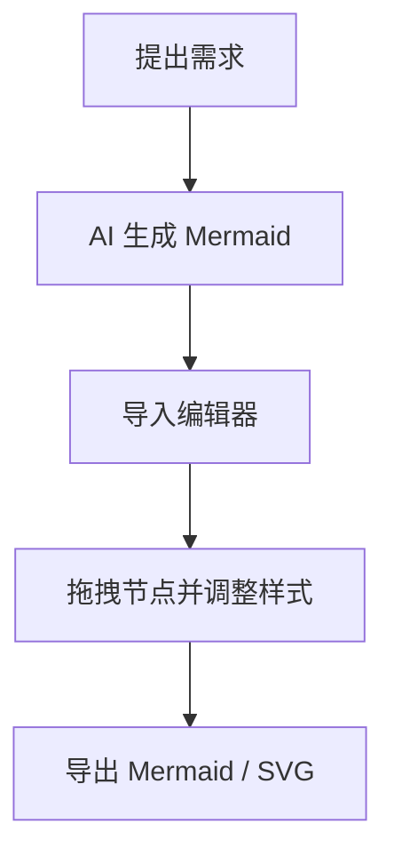

# Mermaid 可视化流程图编辑器

一个本地运行的 Mermaid 流程图可视化编辑器。你可以像画白板一样拖拽节点、连线、调整样式，然后导出标准 Mermaid 语法、`.mmd` 文件或 SVG。

本项目基于开源项目 [mermaid-visual-editor](https://github.com/saketkattu/mermaid-visual-editor) 继续完善和修改，保留 MIT License。


## 适合谁用

- 经常让 AI 生成 Mermaid 图，但还需要手动调整布局和节点的人
- 想用 Mermaid 记录流程，但不想反复修改语法的人
- 写技术文档、产品流程、系统架构图的人
- 想把图保存成文本格式，方便放进 Git、Markdown、Obsidian、知识库的人

## 推荐使用场景

先让 AI 生成一段 Mermaid flowchart 草稿：



然后把这段代码导入编辑器，通过拖拽节点、修改连线、调整样式来完成最终图表。这样既能利用 AI 快速生成结构，又不用在文本里反复改布局和语法。

## 快速开始

```bash
git clone https://github.com/xzo333/mermaid-visual-editor.git
cd mermaid-visual-editor
pnpm install
pnpm dev
```

启动后打开：

```text
http://localhost:3000
```

环境要求：

- Node.js 18+
- pnpm

## 主要功能

- 可视化添加、拖拽、连接节点
- 支持矩形、圆角、菱形、圆形、圆柱、六边形等多种节点形状
- 支持节点文字、连线文字、颜色、线型、箭头样式编辑
- 支持撤销、重做、复制、删除、自动布局
- 支持 Mermaid 实时预览
- 支持复制 Mermaid 语法
- 支持导出 `.mmd`、`.svg`
- 支持保存和加载画布 JSON
- 支持导入 Mermaid flowchart 语法并转成可编辑画布

## 基本用法

1. 导入 AI 生成的 Mermaid flowchart 代码，或点击添加节点从零开始画
2. 从节点边缘的连接点拖到另一个节点，创建连线
3. 双击节点或连线文字进行编辑
4. 在右侧或浮动面板中调整形状、颜色、箭头和图表方向
5. 使用预览确认 Mermaid 渲染效果
6. 复制 Mermaid 语法，或导出 `.mmd` / `.svg`

## 快捷键

| 快捷键 | 功能 |
| --- | --- |
| `N` | 添加节点 |
| `Delete` / `Backspace` | 删除选中节点或连线 |
| `Ctrl + D` | 复制选中节点 |
| `Ctrl + Z` | 撤销 |
| `Ctrl + Shift + Z` | 重做 |
| `Escape` | 取消选择 |

## 技术栈

- Next.js
- React
- React Flow / XY Flow
- Mermaid.js
- Zustand
- Tailwind CSS
- Dagre
- TypeScript

## 开发命令

```bash
pnpm dev      # 本地开发
pnpm build    # 构建生产版本
pnpm start    # 本地运行生产版本
pnpm lint     # 代码检查
```

## 说明

当前重点是 Mermaid flowchart 的可视化编辑体验。其他 Mermaid 图表类型，例如 sequence diagram、mindmap、class diagram，暂未作为主要支持目标。

## License

MIT
